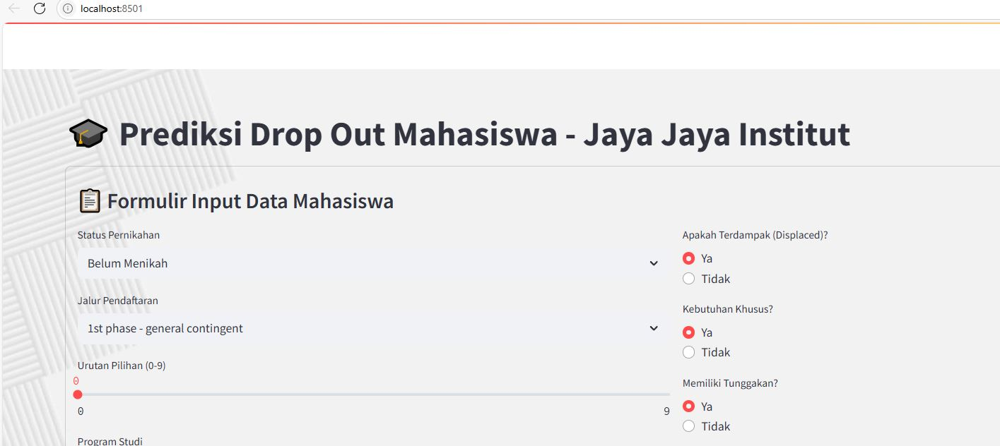
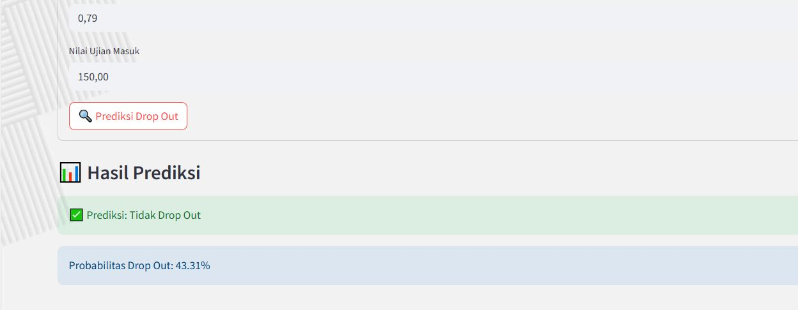
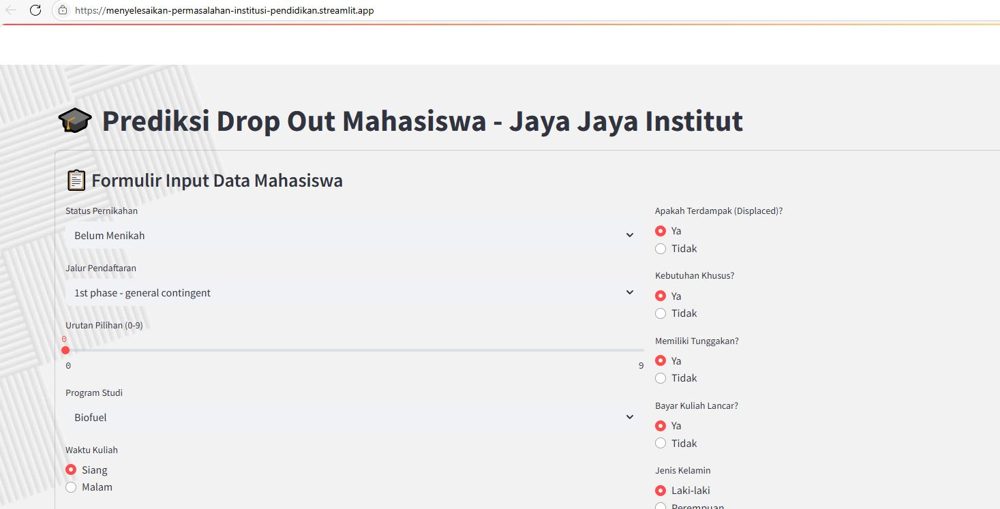

# Proyek Akhir: Menyelesaikan Permasalahan Dropout Mahasiswa di Institusi Pendidikan

## Business Understanding

Jaya Jaya Institut merupakan institusi pendidikan tinggi yang menghadapi tantangan serius terkait tingginya tingkat dropout mahasiswa (>30%). Permasalahan ini berdampak pada reputasi, efisiensi operasional, dan keberhasilan lulusan. Analisis data diperlukan untuk mengidentifikasi pola dan faktor utama penyebab dropout, serta membangun sistem prediksi dan dashboard monitoring untuk intervensi dini.

### Permasalahan Bisnis

Tingginya angka dropout mahasiswa di Jaya Jaya Institut menandakan adanya potensi masalah internal seperti:
- Kesulitan akademik di semester awal
- Permasalahan keuangan (tunggakan biaya kuliah, tidak mendapat beasiswa)
- Kurangnya keterlibatan dalam evaluasi akademik
- Faktor usia dan latar belakang pendidikan
- Tantangan adaptasi pada jurusan tertentu

Dampak negatif yang ditimbulkan:
- Penurunan tingkat kelulusan dan reputasi institusi
- Pemborosan sumber daya (waktu, biaya, tenaga pengajar)
- Berkurangnya kepercayaan calon mahasiswa dan orang tua

### Cakupan Proyek

- Mengidentifikasi faktor-faktor utama penyebab dropout mahasiswa.
- Mengambil keputusan berbasis data untuk menurunkan tingkat dropout.
- Memonitor indikator risiko mahasiswa melalui dashboard visualisasi.
- Melakukan analisis eksploratif terhadap data mahasiswa.
- Membangun model prediktif untuk mengidentifikasi mahasiswa berisiko dropout.
- Menyediakan visualisasi interaktif untuk monitoring data akademik dan keuangan mahasiswa.

### Persiapan

**Sumber data:** link: https://github.com/dicodingacademy/dicoding_dataset/tree/main/students_performance

**Setup environment:**
```bash
pip install -r requirements.txt
```

## Business Dashboard

Dashboard visualisasi yang dikembangkan memberikan gambaran menyeluruh dan interaktif mengenai kondisi mahasiswa di Jaya Jaya Institut. Dashboard ini membantu manajemen dalam memahami tren dropout, distribusi status mahasiswa, dan faktor-faktor utama yang memengaruhi keputusan mahasiswa untuk keluar.
link : https://lookerstudio.google.com/reporting/07abfe73-0e01-479b-b8de-f1a9de6836f4 

Fitur dan Informasi yang Disajikan:**
- Distribusi status mahasiswa (Dropout, Enrolled, Graduate)
- Dropout berdasarkan jurusan (Course) dan kelompok usia (Age Group)
- Analisis faktor akademik: nilai, jumlah mata kuliah disetujui, progres semester awal
- Visualisasi heatmap dan boxplot untuk insight mendalam
- Hasil analisis model machine learning (feature importance)

## Menjalankan Sistem Machine Learning
Sistem ini dirancang untuk membantu institusi pendidikan mengidentifikasi risiko mahasiswa yang berpotensi Drop Out sejak dini, berdasarkan data akademik, keuangan, dan demografis. Model ini menggunakan algoritma **Random Forest** dengan akurasi tinggi dan telah dioptimalkan untuk analisis prediktif.

1. 🔬 Melalui Notebook (Jupyter / Colab)
- Buka file notebook (`notebook.ipynb`).
- isi pada bagian 

- run pada notebook,
- dan hasilnya akan seperti ini


2. Jalankan via Terminal (Script Langsung)
- Pastikan environment telah di-setup (Python & dependency).
- Eksekusi model dengan perintah:
  ```bash
  python cekmodel.py
    

  hasilnya akan seperti ini
    

3. cara ketiga eksekusi dengan UI streamlit dengan menggunakan terminal : python -m streamlit run app.py
isi data pada 


klik prediksi dan akan muncul seperti ini:



4. model prediksi juga bisa diakses secara online dengan url:  https://menyelesaikan-permasalahan-institusi-pendidikan.streamlit.app/
isi data pada 


klik prediksi dan akan muncul seperti ini:


## Conclusion

Berdasarkan hasil model **Random Forest** dan analisis data, dapat disimpulkan bahwa:
1. **Faktor akademik semester awal** (jumlah mata kuliah disetujui dan nilai) sangat menentukan risiko dropout.
2. **Keteraturan pembayaran biaya kuliah** dan status debitur berpengaruh kuat terhadap keputusan mahasiswa untuk bertahan atau keluar.
3. **Usia saat masuk kuliah** dan **jurusan tertentu** memiliki tingkat dropout lebih tinggi, terutama pada kelompok usia muda dan jurusan dengan beban akademik tinggi.
4. **Faktor ekonomi makro** (GDP, tingkat pengangguran) memiliki pengaruh lebih kecil dibanding faktor akademik dan keuangan individu.

Insight Utama

Berdasarkan hasil evaluasi model Random Forest dan XGBoost, faktor utama yang memengaruhi risiko mahasiswa Drop Out adalah progres akademik awal, seperti jumlah mata kuliah yang disetujui dan nilai semester 1 dan 2, yang menjadi indikator kuat keberlanjutan studi. Partisipasi dalam evaluasi pembelajaran juga menunjukkan hubungan positif dengan retensi mahasiswa. Selain itu, nilai masuk (admission grade) dan riwayat pendidikan sebelumnya turut menentukan keberhasilan studi. Faktor keuangan, khususnya keteraturan pembayaran biaya kuliah, memiliki pengaruh signifikan terhadap risiko Drop Out. Usia saat pendaftaran dan jurusan tertentu, terutama di kalangan mahasiswa muda, juga berkontribusi terhadap tingkat keluar yang tinggi. Sebaliknya, faktor eksternal seperti GDP dan tingkat pengangguran memiliki pengaruh yang lebih kecil dibandingkan faktor akademik dan keuangan individu. Oleh karena itu, diperlukan intervensi akademik dini, pemantauan pembayaran, skrining risiko saat pendaftaran, serta dukungan psikososial untuk menurunkan angka Drop Out di institusi.

## Rekomendasi Action Items

1. **Intervensi Akademik Dini**
    - Monitoring progres akademik mahasiswa di semester 1 & 2 secara berkala.
    - Identifikasi mahasiswa dengan nilai rendah atau sedikit mata kuliah yang disetujui sejak awal.
    - Sediakan program remedial, bimbingan belajar, dan mentoring akademik.

2. **Dukungan Keuangan dan Konseling**
    - Identifikasi mahasiswa dengan status debitur atau keterlambatan pembayaran biaya kuliah.
    - Tawarkan solusi seperti keringanan, cicilan, atau beasiswa tambahan.
    - Perkuat layanan konseling keuangan dan sosialisasi program bantuan.

3. **Pendekatan Khusus untuk Jurusan dan Usia Risiko Tinggi**
    - Fokuskan program pencegahan dropout pada jurusan dan kelompok usia yang memiliki tingkat dropout tinggi.
    - Kembangkan program orientasi, adaptasi, dan penguatan soft skill untuk mahasiswa baru, terutama usia <23 tahun.
    - Tawarkan program orientasi dan adaptasi khusus untuk mahasiswa yang lebih tua atau berasal dari latar belakang pendidikan berbeda.
    - Sediakan layanan konseling dan career coaching.

4.  **Insight Usia & Jurusan**
    - Mahasiswa usia 17-19 tahun mendominasi Health/Medicine dan Arts/Communication, namun dropout di Arts/Communication lebih tinggi pada kelompok usia muda.
    - Business/Economy memiliki dropout tertinggi pada mahasiswa usia 30+, menandakan tantangan adaptasi atau beban eksternal pada mahasiswa dewasa.
    - Engineering/Tech dan Social Sciences relatif stabil di semua kelompok usia, namun tetap perlu perhatian pada kelompok usia muda yang baru beradaptasi dengan dunia kampus.

5.  **Action Item Spesifik berdasar Heatmap**
    - Mahasiswa Muda (17-19 tahun) di Arts/Communication: Perkuat orientasi, mentoring, pengembangan soft skill, dan konseling adaptasi sejak awal semester. Libatkan alumni/senior sebagai mentor.
    - Mahasiswa Usia 30+ di Business/Economy: Tawarkan fleksibilitas jadwal (kelas malam, blended learning), konseling karir, manajemen waktu, dan komunitas mahasiswa dewasa.
    - Semua Jurusan dengan Dropout Tinggi: Monitoring progres akademik lebih intensif pada semester awal, kolaborasi dengan dosen wali, program remedial, dan pelatihan belajar efektif.
    - Jurusan dengan Kelulusan Tinggi (Health/Medicine): Jadikan best practice—adopsi sistem pembelajaran, mentoring, dan monitoring yang terbukti efektif di jurusan ini untuk diterapkan di jurusan lain.

6. **Peningkatan Keterlibatan Akademik**
    - Dorong partisipasi aktif dalam evaluasi dan kegiatan akademik.
    - Sediakan workshop motivasi dan manajemen waktu.
    - Libatkan mahasiswa dalam komunitas akademik dan organisasi kampus.

7. **Peningkatan Sistem Monitoring dan Dashboard**
    - Implementasikan dashboard prediksi dropout berbasis data untuk memantau mahasiswa berisiko secara real-time.
    - Integrasikan model prediksi Drop Out ke dalam dashboard monitoring kampus.
    - Tampilkan metrik risiko Drop Out untuk tiap segmen mahasiswa.
    - Buat notifikasi dini untuk dosen wali atau bagian kemahasiswaan jika terdapat kenaikan risiko pada kelompok tertentu.
    - Libatkan dosen wali dan bagian kemahasiswaan dalam pemantauan dan tindak lanjut.

8. **Evaluasi dan Penyesuaian Kurikulum**
    - Tinjau kembali beban dan struktur kurikulum pada jurusan dengan dropout tinggi.
    - Sesuaikan metode pembelajaran agar lebih adaptif terhadap kebutuhan mahasiswa.

### Kesimpulan
Faktor-faktor akademik, keuangan, dan keterlibatan mahasiswa sangat berpengaruh terhadap risiko Drop Out. Intervensi yang tepat dan berbasis data akan membantu institusi menurunkan tingkat Drop Out dan meningkatkan keberhasilan studi mahasiswa.
---

**Kontak:**  
[GitHub](https://github.com/Profdara) | [LinkedIn](https://www.linkedin.com/in/profdara)  
Email: danangrestuaji@gmail.com

---

> *Proyek ini bertujuan membantu institusi pendidikan dalam menurunkan tingkat dropout melalui analisis data, pemodelan prediktif, dan dashboard monitoring berbasis data.*